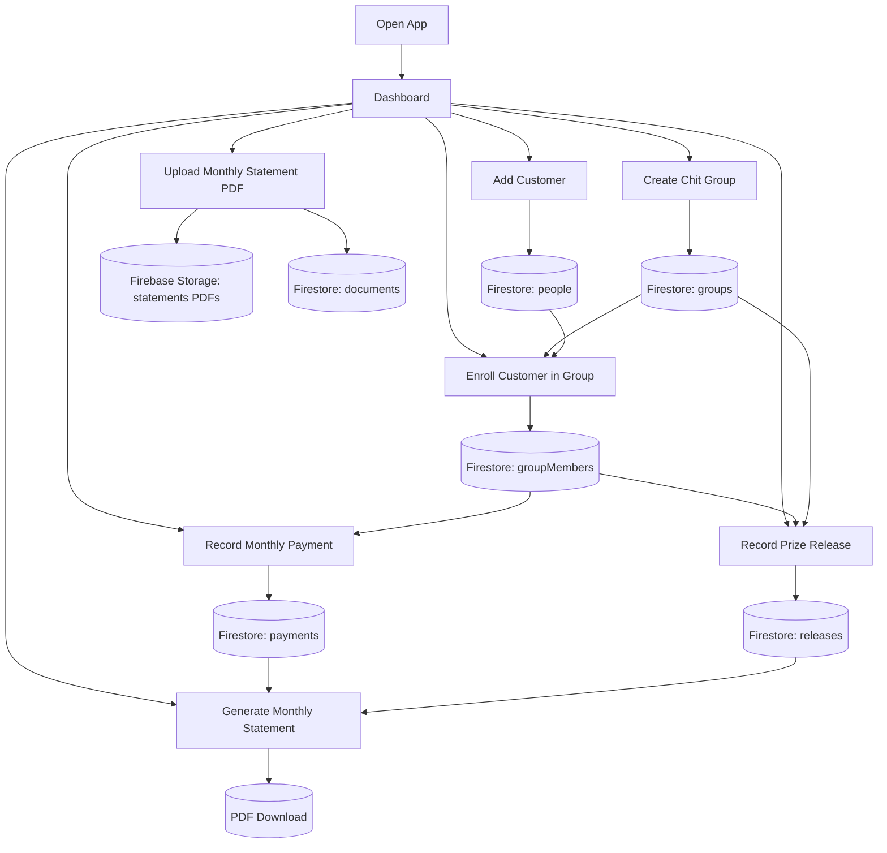

# Chit Finance Application Flow

## Purpose

This application replaces the manual Google Sheets process used every month for chit finance operations. Instead of creating separate spreadsheets and attaching PDFs manually, the app keeps the operational data in Firebase Firestore and stores monthly PDF statements in Firebase Storage.

The goal is to manage the full chit lifecycle in one system:

- Create chit groups
- Add customer records
- Enroll customers into groups
- Record monthly collections
- Record auction or release details
- Generate monthly statements from live data
- Archive PDF statements by month
- View overall business summary from one dashboard

## Main Screens

### 1. Dashboard

The dashboard gives a quick operational summary.

It reads data from Firestore and shows:

- Total groups
- Active groups
- Total customers
- Total memberships
- Total monthly payment entries
- Total released amount
- Total archived statement documents

### 2. Chit Groups

This screen is used to define each chit scheme.

Each group contains:

- Group name
- Monthly share amount
- Member capacity
- Duration in months
- Start month
- Status such as Active, Upcoming, or Closed

This is the base master data for the rest of the app.

### 3. Customers

This screen stores customer master records.

Each customer contains:

- First name
- Last name
- Phone number
- Address
- Created date

Customers are added once and then reused across multiple chit groups.

### 4. Group Members

This screen links customers to chit groups.

Each enrollment contains:

- Group reference
- Customer reference
- Share count
- Monthly contribution
- Joined date

This is the bridge between `groups` and `people`.

### 5. Monthly Payments

This screen records month-wise collections for each enrolled member.

Each payment contains:

- Group
- Member
- Cycle month
- Amount
- Paid date
- Payment mode
- Status such as Paid, Pending, or Partial
- Notes

This replaces the monthly collection spreadsheet entries.

### 6. Prize Releases

This screen records the monthly chit auction or prize release.

Each release contains:

- Group
- Winning member
- Cycle month
- Pot value
- Discount amount
- Released amount
- Dividend per member
- Released date
- Notes

This replaces the release or auction calculation usually tracked in sheets.

### 7. Statement Archive

This screen stores monthly exported PDFs.

Each document contains:

- Title
- Month
- Category
- File name
- Storage path
- Download URL
- Uploaded date

The PDF file itself is stored in Firebase Storage, while the metadata is stored in Firestore.

### 8. Statement Generator

This screen prepares a month-end statement directly from live Firestore data.

The user selects:

- Group
- Cycle month

The generated statement includes:

- Group details
- Member-wise expected contribution
- Member-wise collected amount
- Balance amount
- Payment status
- Paid date
- Release summary for the month
- Total expected, total collected, and outstanding amounts

The statement can then be downloaded directly as a PDF.

## End-to-End Application Flow

The normal business flow is:

1. Create a chit group.
2. Add customer records.
3. Enroll customers into the selected group.
4. For each month, record collections from enrolled members.
5. Record the winning member and release details for that month.
6. Generate the month-end statement from the app.
7. Download the statement as PDF.
8. Upload that PDF into the statement archive if you want it stored in Firebase.
9. Use the dashboard for quick monitoring.

## Visual Flow



## Firestore Data Model

### Collection: `groups`

Stores chit definitions.

Suggested fields:

- `groupName`
- `normalizedGroupName`
- `monthlyShare`
- `memberCapacity`
- `durationMonths`
- `startMonth`
- `status`
- `createdAt`

### Collection: `people`

Stores customer records.

Suggested fields:

- `firstName`
- `lastName`
- `phone`
- `address`
- `createdAt`

### Collection: `groupMembers`

Stores customer enrollment inside a group.

Suggested fields:

- `groupId`
- `personId`
- `groupName`
- `memberName`
- `shareCount`
- `monthlyContribution`
- `joinedAt`

### Collection: `payments`

Stores month-wise member collections.

Suggested fields:

- `groupId`
- `groupName`
- `groupMemberId`
- `personId`
- `memberName`
- `cycleMonth`
- `amount`
- `paidOn`
- `paymentMode`
- `status`
- `notes`
- `createdAt`

### Collection: `releases`

Stores auction or prize release data.

Suggested fields:

- `groupId`
- `groupName`
- `groupMemberId`
- `personId`
- `memberName`
- `cycleMonth`
- `potValue`
- `discountAmount`
- `dividendPerMember`
- `releasedAmount`
- `releasedOn`
- `notes`
- `createdAt`

### Collection: `documents`

Stores metadata for uploaded PDFs.

Suggested fields:

- `title`
- `month`
- `category`
- `fileName`
- `filePath`
- `fileUrl`
- `uploadedAt`

## Firebase Storage Structure

Suggested storage layout:

```text
statements/
  2026-02/
    1710000000000-final-statement-feb.pdf
    1710000001000-collection-sheet-feb.pdf
```

This keeps documents grouped by month.

## How Your Existing Spreadsheet Process Maps Into This App

Current manual process:

- Create monthly Google Sheets
- Enter collections manually
- Enter release details manually
- Export sheets as PDF
- Keep PDFs separately

New app process:

- Group details are stored once in Firestore
- Customer details are stored once in Firestore
- Member enrollments are stored once in Firestore
- Monthly collections are entered as payment records
- Release details are entered as release records
- Statements are generated from live monthly data
- PDF exports are uploaded and indexed inside the app
- Dashboard shows the current business status without opening multiple sheets

## Recommended Monthly Operating Sequence

At the beginning of a new month:

1. Open the app.
2. Select the active group.
3. Record payments for each enrolled member.
4. Mark pending members if payment is not yet received.
5. Run the monthly auction or prize release.
6. Record winner, discount, and release amount.
7. Generate the statement from the app.
8. Download the PDF.
9. Upload the PDF into the archive for that month if you want a permanent copy in Firebase.

## Current Scope

The current application supports:

- Basic CRUD for groups
- Basic CRUD for customers
- Member enrollment per group
- Monthly payment recording
- Release tracking
- Monthly statement generation with PDF download
- PDF upload and archive
- Dashboard summary

## Recommended Next Improvements

To make this production-ready, the next phase should add:

1. Firebase Authentication for admin login
2. Firestore security rules
3. Search and filters by month, group, and customer
4. Edit functionality for all records
5. Duplicate payment prevention for same member and cycle month
6. Automatic month-end statement generation
7. Reports for pending dues and released history
8. Backup or export to Excel and PDF

## Summary

This application is structured as a centralized chit finance management system. The master data starts with groups and customers, those combine into enrollments, enrollments drive monthly collections and prize releases, and the final documents are archived in Firebase Storage with Firestore metadata.

That gives you one connected system instead of separate monthly spreadsheets.
